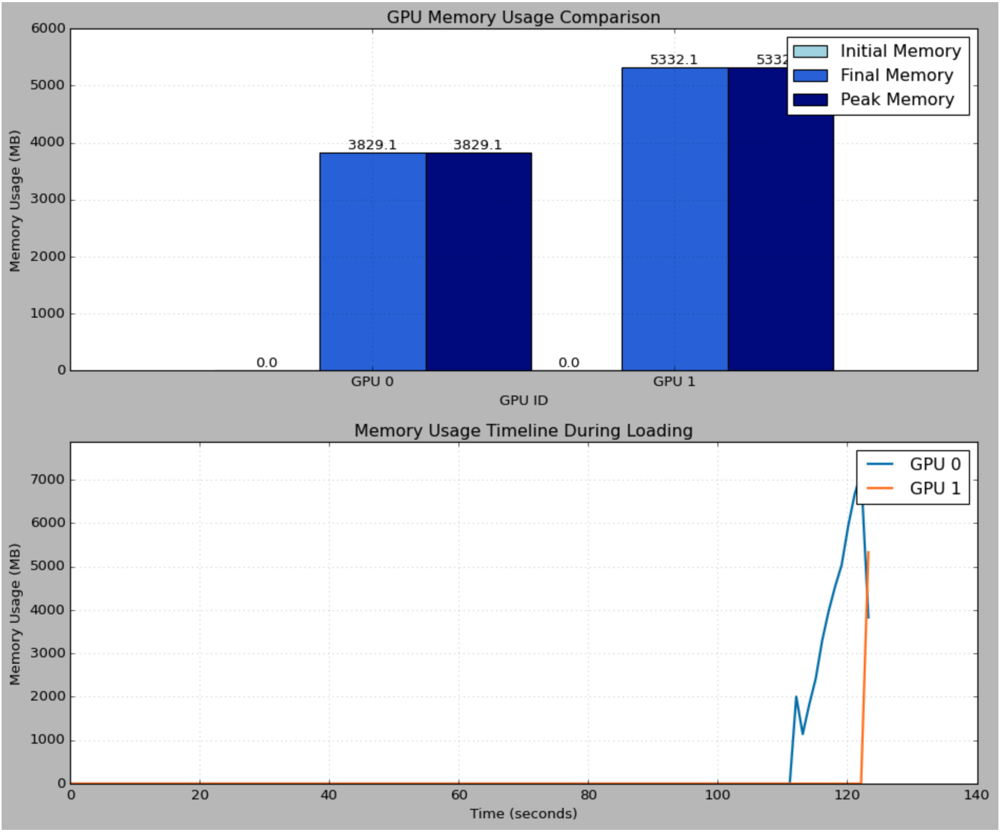
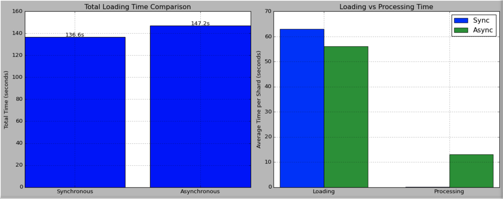
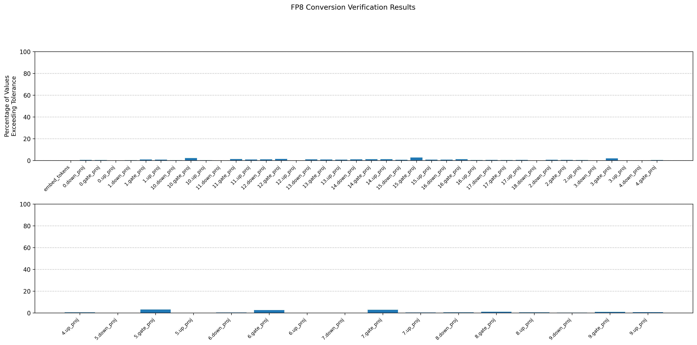
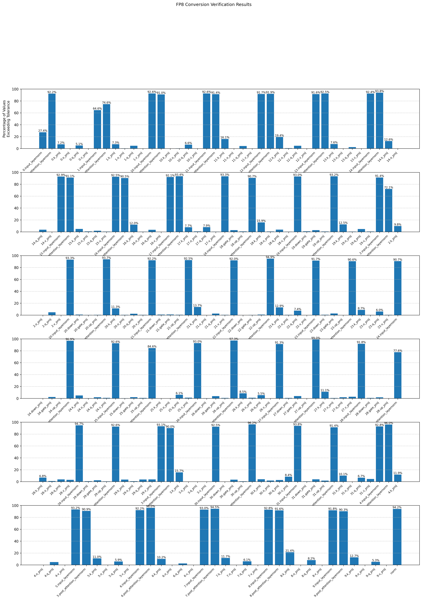

# FP8 Model Loading and Quantization Tool

A high-performance library for loading and quantizing large language models using FP8 format with memory-efficient sharded loading support.

## Features

- **FP8 Quantization**: Support for both e4m3 and e5m2 formats
- **Memory-Efficient Loading**: Sharded model loading with customizable shard sizes
- **Asynchronous Loading**: Background prefetching of model shards
- **Multi-GPU Support**: Intelligent layer distribution across multiple GPUs
- **GPU Memory Optimization**: Automatic memory tracking and optimization
- **Verification System**: Built-in tensor verification for quantization accuracy

## Installation

### Requirements

- Python 3.8+
- PyTorch 2.0+
- CUDA 11.8+
- Newer GPUs with support for FP8 formats, such as NVIDIA H100, L4, or equivalent

```bash
pip install torch>=2.0.0
pip install cupy-cuda11x  # Replace with your CUDA version
pip install safetensors
```

## Quick Start

```python
from fp8_loader import ShardedFP8ModelLoader, FP8Format

# Initialize the loader
loader = ShardedFP8ModelLoader(
    model_dir="path/to/model",
    device_ids=[0, 1],  # Multi-GPU support
    use_async=True,     # Enable async loading
    memory_efficient=True
)

# Load and quantize the model
model = loader.load_model()
```

## Command Line Usage

```bash
python -m fp8_loader.main \
    --model-dir /path/to/model \
    --device-ids 0 1 \
    --shard-size-gb 4 \
    --use-ddp \
    --memory-efficient \
    --mixed-precision
```

## Advanced Configuration

### Custom FP8 Format

```python
from fp8_loader import FP8Format

# Configure e4m3 format
fp8_config = FP8Format(
    e4m3=True,
    scale=1.0,
    dynamic_scaling=True
)

loader = ShardedFP8ModelLoader(
    model_dir="path/to/model",
    fp8_format=fp8_config
)
```

### Asynchronous Loading with Callbacks

```python
class LoadingCallback:
    def on_shard_load(self, shard_file):
        print(f"Loading shard: {shard_file}")
        
    def on_shard_process(self, shard_file):
        print(f"Processing shard: {shard_file}")

loader = ShardedFP8ModelLoader(
    model_dir="path/to/model",
    use_async=True,
    num_prefetch=2
)
loader.register_callback(LoadingCallback())
```

### Memory Optimization

```python
from fp8_loader import GPUMemoryTracker

# Track GPU memory usage
tracker = GPUMemoryTracker(device_ids=[0, 1])

# Get memory stats
for device in tracker.device_ids:
    memory_info = tracker.get_memory_info(device)
    print(f"GPU {device} Memory Usage: {memory_info}")
```

## Technical Details

### FP8 Format Support

- **e4m3**: 4 exponent bits, 3 mantissa bits
- **e5m2**: 5 exponent bits, 2 mantissa bits

### Memory Management

- Automatic shard size calculation based on available GPU memory
- Dynamic tensor offloading for memory-efficient loading
- Intelligent layer distribution across multiple GPUs

### Performance Optimization

- Asynchronous shard prefetching
- CUDA kernel-based tensor verification
- Optimized memory layout for improved access patterns

## Error Handling

The library provides comprehensive error handling and verification:

```python
try:
    model = loader.load_model()
except RuntimeError as e:
    print(f"Error loading model: {e}")
```
## Experimental Results

### Memory Efficiency Analysis
We tested the library on two NVIDIA L4 GPUs (24GB VRAM each) using the LLAMA-3.1-8B-inducted model with FP8 quantization and sharded loading. The model was loaded in two phases, processing 423 tensors in the first shard and 315 in the second, with a total load time of **123.25 seconds**.

**GPU Memory Usage**:
- **GPU 0**: Peak usage of **7,157 MB** (31.8% of VRAM), allocated **3,829 MB**.
- **GPU 1**: Peak usage of **5,332 MB** (22.2% of VRAM), allocated **5,332 MB**.

Both GPUs retained over **17 GB of free memory** post-loading, demonstrating robust memory efficiency and capacity for additional workloads.


---

### Loading Performance: Synchronous vs. Asynchronous
Using a shard size of **4.0 GB** across two GPUs, **synchronous loading** completed in **136.64 seconds**, outperforming **asynchronous loading**, which took **147.22 seconds**. This suggests synchronous loading is more effective in environments with limited GPU counts, as it minimizes the overhead of asynchronous operation management.


---

### Quantization Accuracy Results
For multi-layer perceptron layers, less than **3% of weights** deviated beyond an absolute threshold of **0.001** from original values, indicating high accuracy in quantization. However, attention and layer norm layers showed higher variance, with a mean deviation of **27.37%**. These findings highlight areas for further optimization in preserving accuracy across model components. 



Such a discrepancy can be explained by how the weight values for LayerNorm are generally very small values, and quantizing and dequantizing these weights leads to larger quantization error than MLP weights, which are generally larger in magnitude.

We propose future work to explore the potential for a hybrid approach, combining relative and absolute tolerance levels to determine if particular tensors/weight values are truly exceeding tolerance levels.

## Contributing

Contributions are welcome! Please read our contributing guidelines and submit pull requests to our repository.

## License

This project is licensed under the MIT License - see the LICENSE file for details.

## Acknowledgments

This project utilized the [Meta-Llama-3.1-8B-FP8](https://huggingface.co/neuralmagic/Meta-Llama-3.1-8B-FP8) model hosted on Hugging Face for testing and validation purposes. We thank Neural Magic for making this resource publicly available, enabling comprehensive evaluation of our model loader.

We would also like to express our gratitude to **Dr. Kaoutar El Maghraoui**, our professor, and **IBM mentor Antoni Viros i Martin** for their invaluable guidance and support throughout this project.

## Citation

If you use this library in your research, please cite:

```bibtex
@software{fp8_loader,
    title = {FP8 Model Loading and Quantization Tool},
    year = {2024},
    author = {Student Project Team: Jian Zhang, Hairan Liang, Xinchen Zhang},
    institution = {Columbia University},
    note = {Developed as part of Machine Learning course under the guidance of Dr. Kaoutar El Maghraoui and IBM mentor Antoni Viros i Martin},
    description = {High-performance library for loading and quantizing large language models using FP8 format, developed as an educational project}
}
```
